# TABLE OF CONTENTS
|Chapter No.|Title|
|-----------|-----|
|1.|[INTRODUCTION](#1.-Introduction)|
|2.|ARCHITECTURE OF LANGUAGE|
|3.|LITERATURE SURVEY|
|4.|CONTEXT FREE GRAMMAR|
|5.|DESIGN STRATEGY|
|6.|IMPLEMENTATION DETAILS|
|7.|INSTRUCTIONS FOR USING THE COMPILER|
|8.|RESULTS AND SHORTCOMINGS|
|9.|SNAPSHOTS|
|10.|CONCLUSION|
|11.|FURTHER ENHANCEMENTS|

## 1. Introduction
Our mini-compiler is built for a subset of the PhP language (i.e. only while and if-else statements). We have used tools such as yacc, lex and Python scripts to build the complete compiler. An example of what our compiler produces -
### Sample Input
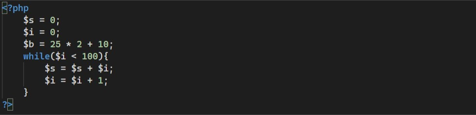
### Sample Output
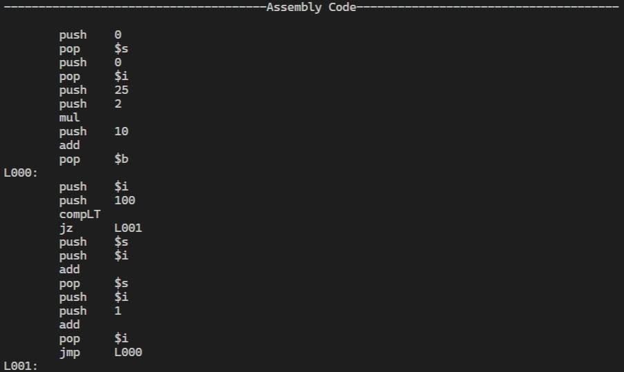

## 2. Architecture of Language
Our compiler supports the following language features -
* We handle variables of integer type only and it supports all integer operations.
* All types of arithmetic and logical expressions are handled.
* While and if-else statements are also handled.

## 3. Literature Survey
* [Yacc Documentation](http://dinosaur.compilertools.net/yacc/)
* [Lex Documentation](http://dinosaur.compilertools.net/lex/index.html)

## 4. Context Free Grammar
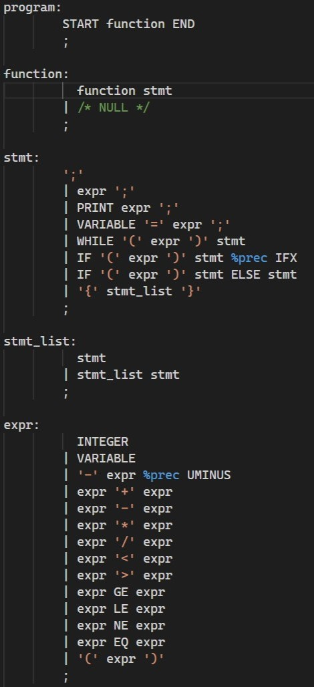

## 5. Design Strategy
### Symbol Table Creation
* There are usually multiple scopes in a program.
* Scope is decided on how many open curly braces we see before we store the variable in the symbol table.
* Whenever we see a variable declared or initialized with a constant value, we store it in the symbol table.
### Abstract Syntax Tree
* The abstract syntax tree is generated as we parse the program.
* A tree node is created based on the type of tokens parsed.
* We handle three basic types of nodes, that is - constant, identifier and operator.
* All these nodes are built from bottom up to form the abstract syntax tree.
### Intermediate Code Generation
* To generate intermediate code, we also make use of the parse tree indirectly.
* We have written quadruple form of code to a file based on the syntax we are currently parsing in the program.
* We make use of multiple stacks for this process.
### Code Optimization
* We have performed reduction in number of live registers and constant folding optimization.
* We have performed the optimization using C and Python.
* We analyze the program line by line and use string manipulation and stack to perform these optimizations.
### Error Handling - strategies and solutions used in our Mini-Compiler implementation (in its scanner, parser, semantic analyzer, and code generator)
* The scanner doesn’t crash when it comes across unknown symbols.
* The parser doesn’t stop parsing on encountering error and prints a syntax error at the corresponding line number.
* Semantic analyzer produces an error on uninitialized variables, undeclared variables and re-declaration of variables.
* The code generator expects error free code to be passed to it.
### Target Code Generation
* Target code is generated using a simple load-use-store mechanism.
* This is done by looking at quadruple address code line by line.

## 6. Implementation Details (Tools and Data Structures Used in order to implement the following)
### Symbol Table Creation
* We use lex, yacc and custom code to generate the symbol table.
* We hold the type, value and name of variables in an array of structures.
* These array of structures are different for different scopes.
* The symbol table therefore has an array of scopes which store an array of variables.
* We also use a stack to maintain the current scope.
### Abstract Syntax Tree (internal representation)
* The abstract syntax tree basically consists of only three types of nodes that we have defined -
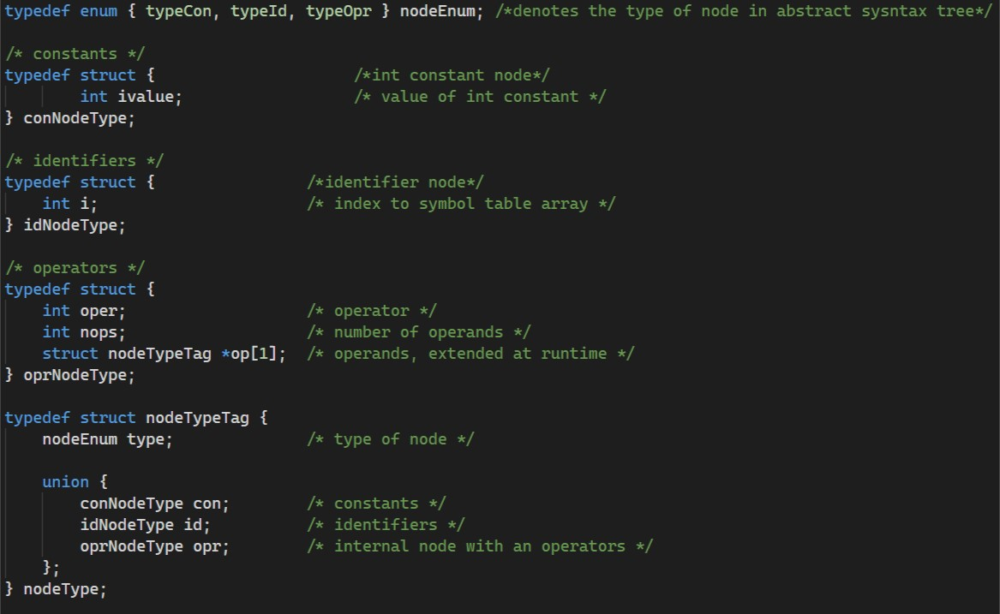
* These nodes are built bottom up using yacc.
### Intermediate Code Generation
* We maintain a stack of all the operators and identifiers we parse. There’s also a stack for maintaining the labels.
* When a production symbol is completely parsed, we pop from the stack and print it to a file according to the symbol we parsed.
* We make use of the labels stack when dealing with the while loop and switch construct. Appropriately consuming the stack to print labels for loop and case statements.
* Also an arithmetic code generation function, which generates suitable code for any required operator.
### Code Optimization
* We use Python and basic string manipulation to convert three address code into optimized three address code.
* For constant folding we just inspect every statement and use raw string manipulation.
* For dead code removal, we use Python sets to find out variables not being used in the code.
### Assembly Code Generation
* We use Python and basic string manipulation to convert optimized three address code into target assembly code.
* We use a hash table just to maintain the required condition variable to be loaded for the while loop.
### Error Handling
* In the parser, we use yacc’s built-in error handling mechanism.
* In the semantic analyzer we use the symbol table to catch any errors.
## 7. Instructions for using the compiler
* Change your directory to PhP-Compiler.
* Write your code in sample.php file.
* Then run  `bash compiler.sh` in the terminal of your linux machine.

## 8. Results and Shortcomings
* Our compiler is a very minimal and basic, and handles programs which purely perform mathematical computations.
* Error handling of our compiler is not exhaustive and too simple to handle complicated errors.
* Assembly code output will be correct for any type of program that our grammar parses. However, the cost of the program is high due to a simple assembly generation algorithm.

## 9. Snapshots
### Sample input
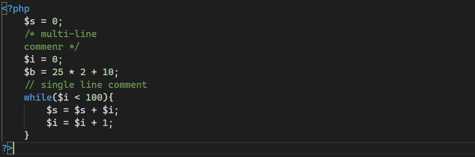
### Code after stripping out comments
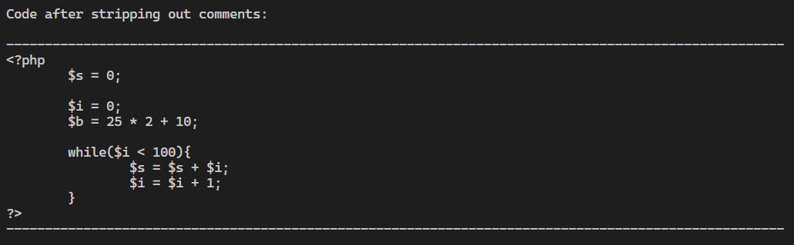
### Symbol and keyword table
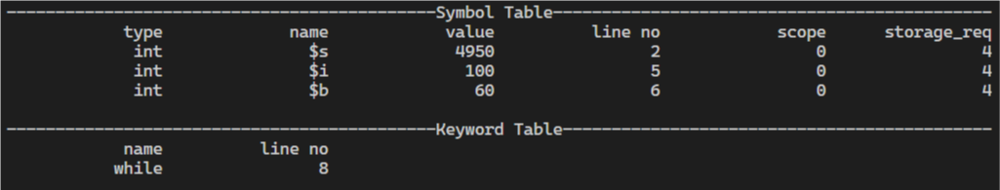
### Abstract syntax tree
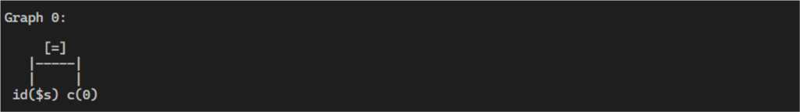
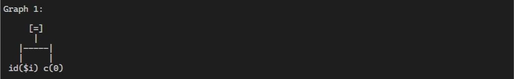
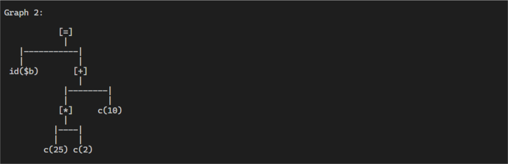
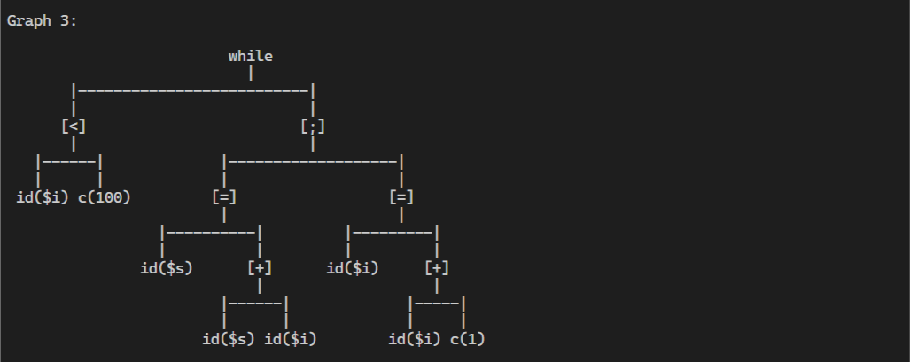
### Intermediate code
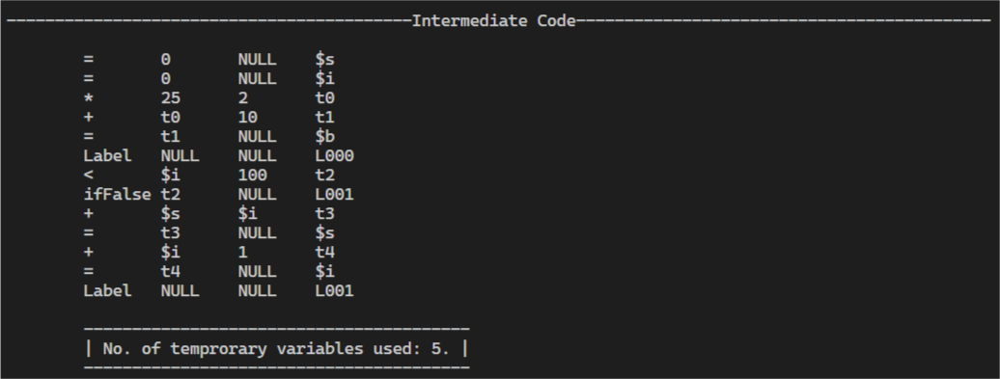
### Optimized intermediate code
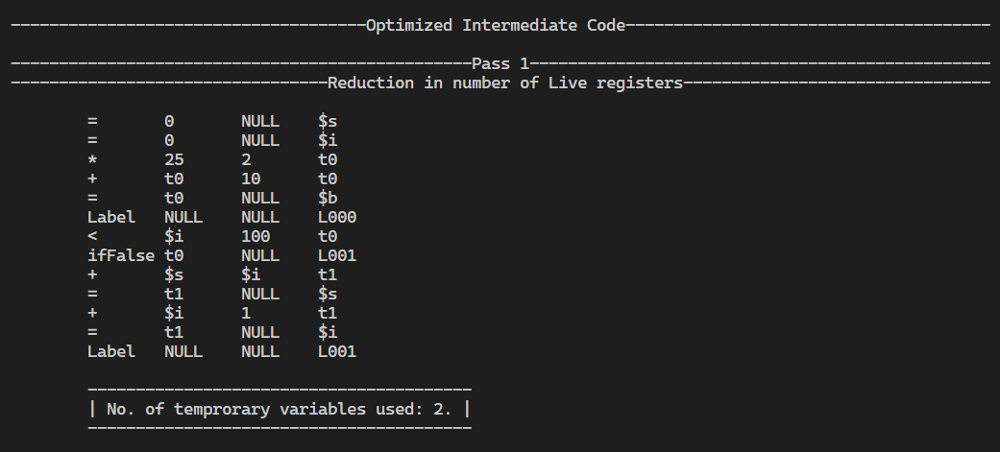
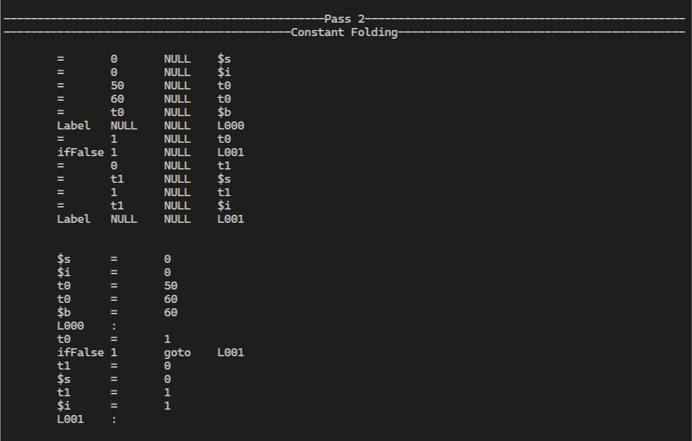
### Assembly code
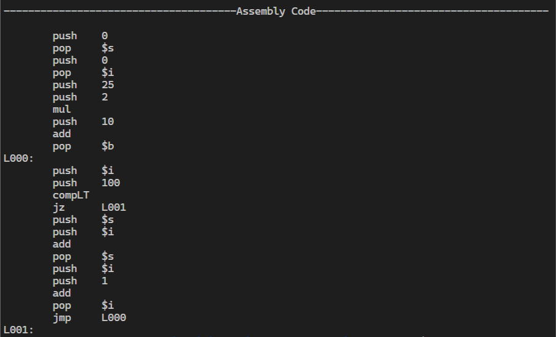

## 10. Conclusions
* It’s very easy to type a command to compile a program, but writing and understanding all phases of a compiler is challenging.
* Powerful tools like Lex and Yacc can be used in order to replicate or build a compiler.
* Working on this project has helped us grasp the internals and all the phases of a compiler.

## 11. Further Enhancements
* Handling more data types.
* Handling arrays, pointers etc.
* Function calls and argument parsing.
* More efficient assembly code generator.

## References/Bibliography
* Intermediate Code Generation -
 https://www.cse.iitm.ac.in/~rupesh/teaching/compiler/aug15/schedule/5-ir.pdf
* Lex and Yacc: A Brisk Tutorial - https://www2.cs.arizona.edu/classes/cs453/fall14/DOCS/tutorial-large.pdf
* Assembly Code Generation -
 https://web.cs.ucdavis.edu/~pandey/Teaching/ECS142/Lects/final.codegen.pdf
* Course notes.
